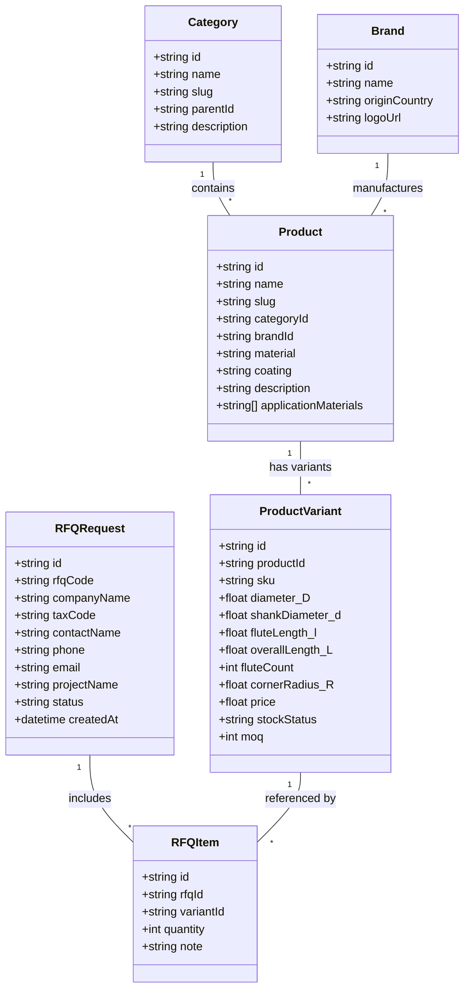

# DOMAIN MODEL (MÔ HÌNH MIỀN NGHIỆP VỤ B2B)

## GIẢI THÍCH MÔ HÌNH THỰC THỂ
1. **Category & Brand:** Tổ chức danh mục ngành hàng cơ khí và thương hiệu đối tác phân phối chính hãng.
2. **Product (Sản phẩm mẹ):** Đại diện cho một dòng dụng cụ (ví dụ: "Dao phay ngón 4 me phủ TiAlN dòng HRC55"). Chứa thông tin chung về vật liệu gia công, lớp phủ, góc xoắn.
3. **ProductVariant (Biến thể SKU):** Chứa thông số hình học chính xác (D, d, l, L, R) cho từng kích thước cụ thể. Đây là thực thể được thêm vào giỏ RFQ.
4. **RFQRequest & RFQItem:** Đơn yêu cầu báo giá theo dự án B2B.
