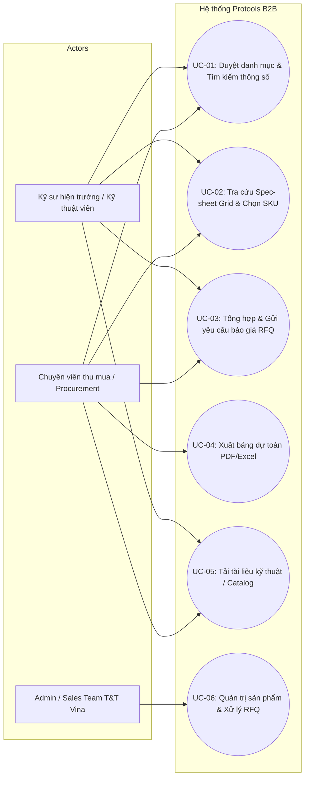

# USE CASE MODEL — PROTOOLS.COM.VN

## DANH MỤC TRUY XUẤT USE CASES
- [`UC-01`](file:///d:/T&TVina/protools/.project/requirements/use-cases/UC-01-catalog-browsing.md): Duyệt danh mục & Tìm kiếm
- [`UC-02`](file:///d:/T&TVina/protools/.project/requirements/use-cases/UC-02-spec-sheet-lookup.md): Tra cứu Spec-sheet Grid
- [`UC-03`](file:///d:/T&TVina/protools/.project/requirements/use-cases/UC-03-rfq-cart-submission.md): Tổng hợp và gửi RFQ
- `UC-04`: Xuất bảng dự toán PDF
- `UC-05`: Tải tài liệu kỹ thuật
- `UC-06`: Quản trị hệ thống và xử lý đơn RFQ
