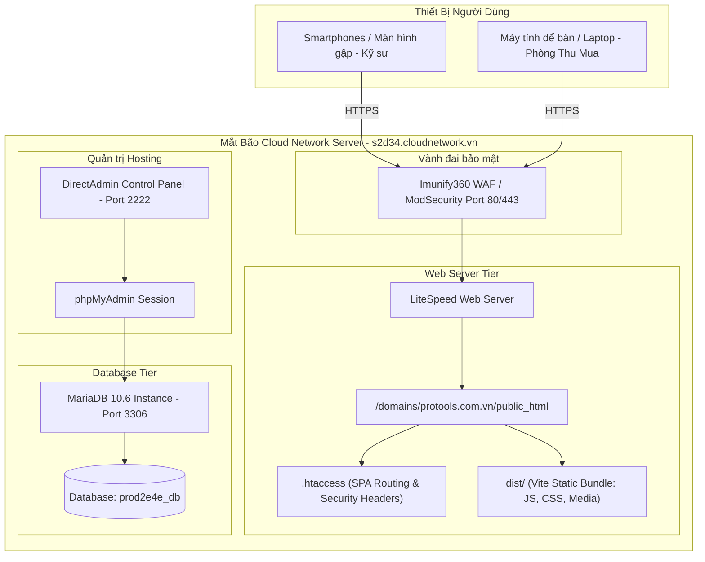

# DEPLOYMENT DIAGRAM — HẠ TẦNG TRIỂN KHAI

## QUY TRÌNH DEPLOY PRODUCTION TỰ ĐỘNG
- **Script Deploy:** [`deploy_protools.py`](file:///d:/T&TVina/protools/deploy_protools.py).
- **Thư mục sao lưu an toàn:** [`backups/`](file:///d:/T&TVina/protools/backups/).
- **Cấu hình `.htaccess`:** Điều hướng toàn bộ non-file requests về `index.html` (SPA standard fallback) và thiết lập MIME types gzip/brotli.
