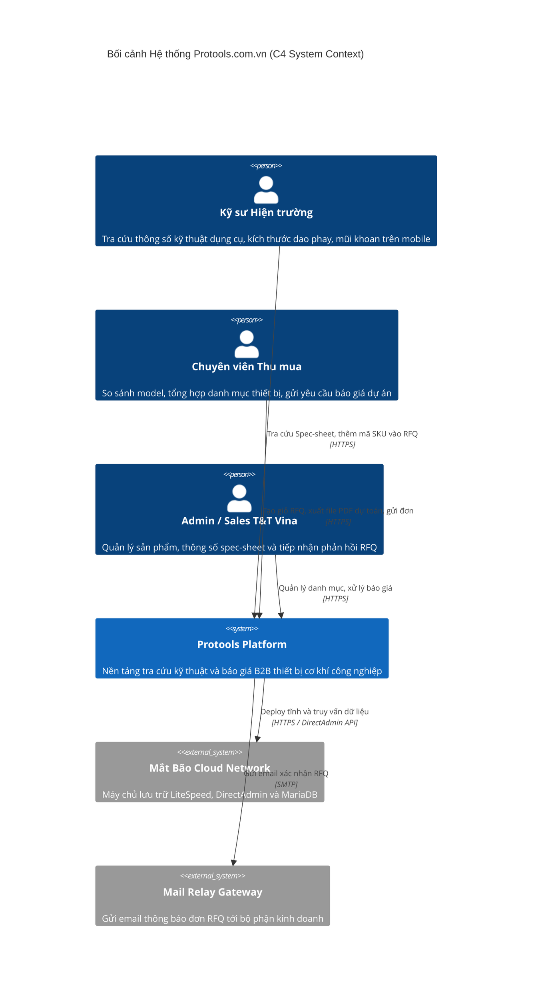

# SYSTEM CONTEXT (BỐI CẢNH HỆ THỐNG C4 MODEL - LEVEL 1)

```mermaid
C4Context
    title Bối cảnh Hệ thống Protools.com.vn (C4 System Context)

    Person(fieldEngineer, "Kỹ sư Hiện trường", "Tra cứu thông số kỹ thuật dụng cụ, kích thước dao phay, mũi khoan trên mobile")
    Person(procurementOfficer, "Chuyên viên Thu mua", "So sánh model, tổng hợp danh mục thiết bị, gửi yêu cầu báo giá dự án")
    Person(adminSales, "Admin / Sales T&T Vina", "Quản lý sản phẩm, thông số spec-sheet và tiếp nhận phản hồi RFQ")

    System(protoolsApp, "Protools Platform", "Nền tảng tra cứu kỹ thuật và báo giá B2B thiết bị cơ khí công nghiệp")

    System_Ext(matbaoHost, "Mắt Bão Cloud Network", "Máy chủ lưu trữ LiteSpeed, DirectAdmin và MariaDB")
    System_Ext(emailService, "Mail Relay Gateway", "Gửi email thông báo đơn RFQ tới bộ phận kinh doanh")

    Rel(fieldEngineer, protoolsApp, "Tra cứu Spec-sheet, thêm mã SKU vào RFQ", "HTTPS")
    Rel(procurementOfficer, protoolsApp, "Tạo giỏ RFQ, xuất file PDF dự toán, gửi đơn", "HTTPS")
    Rel(adminSales, protoolsApp, "Quản lý danh mục, xử lý báo giá", "HTTPS")
    Rel(protoolsApp, matbaoHost, "Deploy tĩnh và truy vấn dữ liệu", "HTTPS / DirectAdmin API")
    Rel(protoolsApp, emailService, "Gửi email xác nhận RFQ", "SMTP")
```
