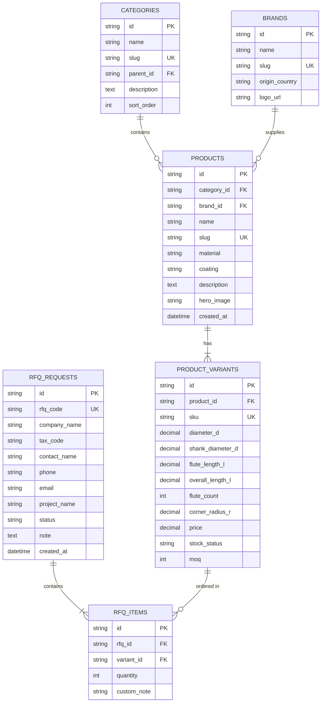

# ENTITY RELATIONSHIP DIAGRAM (ERD) — B2B PROTOOLS CATALOG

```mermaid
erDiagram
    CATEGORIES ||--o{ PRODUCTS : "contains"
    BRANDS ||--o{ PRODUCTS : "supplies"
    PRODUCTS ||--|{ PRODUCT_VARIANTS : "has"
    RFQ_REQUESTS ||--|{ RFQ_ITEMS : "contains"
    PRODUCT_VARIANTS ||--o{ RFQ_ITEMS : "ordered in"

    CATEGORIES {
        string id PK
        string name
        string slug UK
        string parent_id FK
        text description
        int sort_order
    }

    BRANDS {
        string id PK
        string name
        string slug UK
        string origin_country
        string logo_url
    }

    PRODUCTS {
        string id PK
        string category_id FK
        string brand_id FK
        string name
        string slug UK
        string material
        string coating
        text description
        string hero_image
        datetime created_at
    }

    PRODUCT_VARIANTS {
        string id PK
        string product_id FK
        string sku UK
        decimal diameter_d
        decimal shank_diameter_d
        decimal flute_length_l
        decimal overall_length_l
        int flute_count
        decimal corner_radius_r
        decimal price
        string stock_status
        int moq
    }

    RFQ_REQUESTS {
        string id PK
        string rfq_code UK
        string company_name
        string tax_code
        string contact_name
        string phone
        string email
        string project_name
        string status
        text note
        datetime created_at
    }

    RFQ_ITEMS {
        string id PK
        string rfq_id FK
        string variant_id FK
        int quantity
        string custom_note
    }
```
