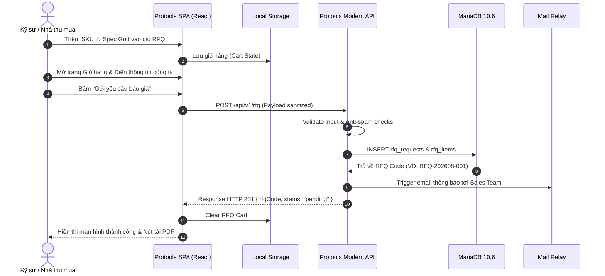

# SEQUENCE DIAGRAM: SEQ-01 — QUY TRÌNH GỬI YÊU CẦU BÁO GIÁ (RFQ)

```mermaid
sequenceDiagram
    autonumber
    actor FE as Kỹ sư / Nhà thu mua
    participant UI as Protools SPA (React)
    participant LS as Local Storage
    participant API as Protools Modern API
    participant DB as MariaDB 10.6
    participant Mail as Mail Relay

    FE->>UI: Thêm SKU từ Spec Grid vào giỏ RFQ
    UI->>LS: Lưu giỏ hàng (Cart State)
    FE->>UI: Mở trang Giỏ hàng & Điền thông tin công ty
    FE->>UI: Bấm "Gửi yêu cầu báo giá"
    UI->>API: POST /api/v1/rfq (Payload sanitized)
    API->>API: Validate input & Anti-spam checks
    API->>DB: INSERT rfq_requests & rfq_items
    DB-->>API: Trả về RFQ Code (VD: RFQ-202608-001)
    API->>Mail: Trigger email thông báo tới Sales Team
    API-->>UI: Response HTTP 201 { rfqCode, status: "pending" }
    UI->>LS: Clear RFQ Cart
    UI-->>FE: Hiển thị màn hình thành công & Nút tải PDF
```
