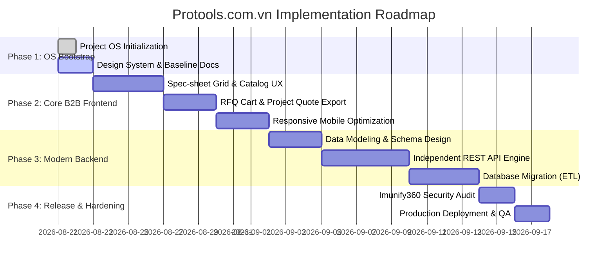

# PROJECT ROADMAP — PROTOOLS.COM.VN

## CHI TIẾT TỪNG GIAI ĐOẠN

### Phase 1: Project OS Bootstrap & Knowledge Foundation (Hiện tại)
- Thiết lập hệ thống thư mục 3 tầng: `.project/`, `.agents/`, `.tasks/`, `.handoffs/`, `.memory/`.
- Chuẩn hóa tài liệu SRS, SAD, Architecture, Design System và ADRs.
- Cấu hình 7 vai trò Subagents chuyên trách.

### Phase 2: Core B2B Frontend & User Experience
- Tối ưu hóa UI/UX Spec-sheet Grid theo chuẩn Industrial Precision.
- Triển khai tính năng tạo giỏ Yêu cầu báo giá (RFQ) và xuất PDF dự toán.
- Kiểm thử độ nhạy Touch Target 48px trên thiết bị thực địa.

### Phase 3: Independent Modern Backend & Data Pipeline
- Thiết kế Data Model chuẩn cho B2B Industrial Catalog.
- Xây dựng Backend REST API độc lập (ADR-004), tách biệt hoàn toàn với WordPress.
- Xây dựng công cụ ETL trích xuất dữ liệu an toàn từ dump database MariaDB cũ.

### Phase 4: Verification, Security Hardening & Release
- Đánh giá tuân thủ WAF Imunify360, kiểm tra tải và bảo mật form RFQ.
- Triển khai Production an toàn qua script [`deploy_protools.py`](file:///d:/T&TVina/protools/deploy_protools.py).
