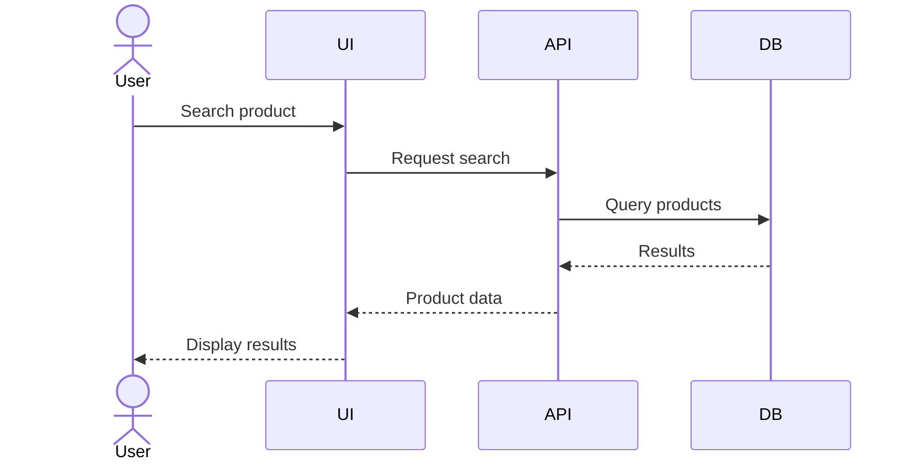

# Protools Core Engine — Project OS Bootstrap Specification

## 0. Mission

You are initializing a long-lived AI-native software project workspace.

Your goal is NOT merely to create folders for multiple agents.
Your goal is to create a **Project Operating System (Project OS)** that allows Protools Core Engine and future agents to work on the same project for a long time without losing context, inventing assumptions, duplicating decisions, breaking architecture, or becoming less reliable as the project grows.

The Project OS must preserve:

- project identity
- current project state
- requirements
- analysis and system design
- architecture
- diagrams
- decisions and their rationale
- task state
- agent handoffs
- lessons learned
- traceability from business goal to code and tests

The project is currently a rebuild/redevelopment of `https://protools.com.vn/`, whose legacy environment uses WordPress and hosting infrastructure managed through Mắt Bão. This legacy information is context only. **Do not permanently couple the new project architecture to WordPress, Laravel, PHP, MySQL, or any other implementation technology unless an explicit project decision is recorded.**

The current frontend direction is React. Backend technology is intentionally undecided.

---

# 1. Core Principles

Apply these principles to every future agent and every major project change.

## 1.1 Project-first, agent-second

Agents are workers. The project knowledge base is the source of truth.

Do not store essential project knowledge only inside an agent-specific folder or prompt.

## 1.2 Progressive context loading

Never require an agent to read the entire repository before working.

Use this order whenever possible:

1. `AGENTS.md`
2. `.project/snapshot.md`
3. relevant task
4. relevant requirements/decisions/knowledge
5. relevant source code

Load more context only when necessary.

## 1.3 Explicit knowledge beats hidden assumptions

If an important fact, constraint, requirement, decision, or architectural rule is discovered, record it in the appropriate Project OS location.

Do not rely on conversational memory alone.

## 1.4 No architecture by accidental drift

Do not introduce a new architectural direction merely because it is convenient for the current task.

Check existing decisions first.

If a major change is needed, create or update an ADR and update relevant project state.

## 1.5 Critical Thinking before irreversible decisions

Major decisions must be challenged before implementation.

The Critical Thinking Agent is a challenger/devil's advocate, not a coder and not the final decision maker.

## 1.6 Traceability is mandatory

Important work must be traceable:

`Business Goal → Requirement → Use Case → Design/Diagram → Task → Code → Test`

## 1.7 Keep the project technology-agnostic where technology is undecided

Current facts:

- Frontend direction: React
- Legacy system: WordPress
- Legacy environment includes PHP/MySQL/hosting infrastructure
- Backend for the new project: undecided

Do not assume `React → Laravel → MySQL` unless formally decided later.

## 1.8 Preserve reversibility

Prefer decisions that are explicit, documented, and reversible where practical.

Document migration cost and lock-in risk for major technology choices.

---

# 2. Required Initial Structure

Create the following structure from the project root.

```text
project-root/
│
├── AGENTS.md
├── README.md
│
├── .agents/
│   ├── orchestrator/
│   │   └── AGENTS.md
│   ├── researcher/
│   │   └── AGENTS.md
│   ├── analyst/
│   │   └── AGENTS.md
│   ├── architect/
│   │   └── AGENTS.md
│   ├── developer/
│   │   └── AGENTS.md
│   ├── reviewer/
│   │   └── AGENTS.md
│   └── critical-thinking/
│       └── AGENTS.md
│
├── .project/
│   ├── identity.md
│   ├── constitution.md
│   ├── snapshot.md
│   ├── current-state.md
│   ├── roadmap.md
│   ├── glossary.md
│   │
│   ├── requirements/
│   │   ├── SRS.md
│   │   ├── functional-requirements.md
│   │   ├── non-functional-requirements.md
│   │   ├── business-rules.md
│   │   └── use-cases/
│   │
│   ├── analysis/
│   │   ├── domain-model.md
│   │   ├── use-case-model.md
│   │   ├── user-flows/
│   │   ├── process-flows/
│   │   └── data-flow/
│   │
│   ├── architecture/
│   │   ├── architecture.md
│   │   ├── system-context.md
│   │   ├── component-diagram.md
│   │   ├── deployment-diagram.md
│   │   └── technology-stack.md
│   │
│   ├── diagrams/
│   │   ├── sequence/
│   │   ├── activity/
│   │   ├── class/
│   │   ├── erd/
│   │   └── state/
│   │
│   ├── data/
│   │   ├── data-model.md
│   │   ├── database-schema.md
│   │   └── master-data.md
│   │
│   ├── traceability/
│   │   ├── requirements-matrix.md
│   │   ├── requirement-to-design.md
│   │   ├── requirement-to-code.md
│   │   ├── requirement-to-test.md
│   │   └── coverage.md
│   │
│   ├── decisions/
│   │   └── README.md
│   │
│   ├── knowledge/
│   └── history/
│
├── .tasks/
│   ├── backlog/
│   ├── active/
│   ├── blocked/
│   ├── review/
│   └── completed/
│
├── .handoffs/
│   ├── incoming/
│   ├── outgoing/
│   └── archive/
│
├── .memory/
│   ├── lessons/
│   ├── mistakes/
│   ├── patterns/
│   └── discoveries/
│
├── docs/
├── src/
├── public/
└── tests/
```

Create missing directories and baseline files. Do not delete or overwrite valuable existing project files.

If the repository already contains equivalent structures, consolidate carefully rather than duplicating them.

---

# 3. Root AGENTS.md

Create a root `AGENTS.md` that acts as the operational constitution for all agents.

It must state that every agent should:

1. read root `AGENTS.md`
2. read `.project/snapshot.md`
3. inspect the current task
4. locate relevant requirements and ADRs
5. avoid assumptions that conflict with recorded project knowledge
6. keep changes scoped
7. update relevant documentation when behavior or architecture changes
8. preserve traceability
9. run appropriate validation/tests
10. report incomplete work honestly

It must also state:

- do not commit secrets
- do not silently change public URLs
- do not modify production infrastructure without explicit authorization
- do not invent APIs, data models, or business rules
- do not mark work complete when acceptance criteria are not satisfied

---

# 4. Project Memory Model

The project has three primary memory layers.

## 4.1 Long-term project memory

Location: `.project/`

Contains stable facts, requirements, system design, architecture, decisions, and validated knowledge.

## 4.2 Working memory

Location: `.tasks/` and `.handoffs/`

Contains what is being worked on, what is blocked, what is under review, and what one agent hands to another.

## 4.3 Learning memory

Location: `.memory/`

Contains lessons, mistakes, reusable patterns, and discoveries.

Do not turn `.memory/` into a dump of every agent thought.

Only persist information that is useful for future work.

---

# 5. Memory Lifecycle

Use this lifecycle for discoveries:

`Discovery → Temporary Understanding → Validated Knowledge → Project Knowledge / Decision / Pattern`

Do not permanently store an unverified assumption as fact.

When uncertainty exists, label it explicitly:

- `KNOWN`
- `ASSUMED`
- `UNVERIFIED`
- `DECIDED`
- `DEPRECATED`

---

# 6. Requirements and SRS

Create `.project/requirements/SRS.md` as the primary Software Requirements Specification.

The SRS is a living artifact, not a one-time document.

It should include at least:

- purpose
- scope
- stakeholders/personas
- functional requirements
- non-functional requirements
- business rules
- constraints
- integrations
- assumptions
- acceptance criteria
- requirement IDs

Use stable IDs such as:

- `BUS-*` business goals
- `FR-*` functional requirements
- `NFR-*` non-functional requirements
- `BR-*` business rules
- `UC-*` use cases
- `TASK-*` tasks
- `TEST-*` tests
- `SEQ-*` sequence diagrams
- `ADR-*` architecture decisions

Do not renumber existing IDs casually.

---

# 7. Analysis and SAD

Treat System Analysis & Design as a living knowledge system.

Maintain:

- domain model
- use-case model
- user flows
- process flows
- data flows
- system context
- component model
- deployment model
- state models where useful

Do not create documentation merely for appearance. Every artifact should answer a real design or reasoning question.

---

# 8. Diagrams

Use Markdown + Mermaid for diagrams whenever practical so diagrams remain version-controlled and AI-readable.

Maintain dedicated folders for:

- sequence diagrams
- activity diagrams
- class/domain diagrams
- ERD
- state diagrams

Sequence diagrams are especially important for non-trivial flows.

Example:



Only create sequence diagrams for meaningful flows; do not generate dozens of meaningless diagrams.

---

# 9. Traceability System

Maintain traceability under `.project/traceability/`.

At minimum support:

`Business Goal → Requirement → Use Case → Design → Task → Code → Test`

Maintain these artifacts:

### requirements-matrix.md

Master mapping between requirements and downstream implementation/testing.

### requirement-to-design.md

Maps requirements to use cases, flows, diagrams, and architecture/design artifacts.

### requirement-to-code.md

Maps important requirements/tasks to relevant code areas.

### requirement-to-test.md

Maps requirements to automated/manual tests.

### coverage.md

Summarizes coverage gaps:

- requirements without design
- requirements without implementation
- implemented requirements without tests
- tests without traceable requirements

Do not claim 100% coverage unless evidence supports it.

---

# 10. ADR / Decision System

Create Architecture Decision Records under `.project/decisions/`.

Recommended format:

```text
ADR-XXX

Title:
Status: Proposed | Accepted | Rejected | Superseded
Date:
Context:
Problem:
Decision:
Alternatives:
Trade-offs:
Consequences:
Related Requirements:
Related Tasks:
```

Before introducing a major architectural change:

1. search existing ADRs
2. identify conflicts
3. run Critical Thinking review
4. create/update ADR
5. update architecture documentation
6. update traceability if needed

---

# 11. Critical Thinking Agent

Create `.agents/critical-thinking/AGENTS.md`.

Its role:

- challenge assumptions
- identify hidden coupling
- find missing requirements
- identify failure modes
- question unnecessary complexity
- compare alternatives
- identify long-term maintenance costs
- identify migration/lock-in risk
- challenge architecture and major product decisions

It must NOT:

- act as the final authority
- modify production code as part of a challenge
- reject ideas merely because they are different
- create pointless debate for trivial changes

### Trigger policy

Level 0 — no challenge required:

- typo fixes
- cosmetic changes
- small refactors with no architectural impact
- simple copy changes

Level 1 — recommended:

- new dependencies
- meaningful component changes
- API changes
- data structure changes
- moderate refactors

Level 2 — mandatory:

- architecture changes
- database schema changes
- authentication/authorization changes
- public URL changes
- security-sensitive changes
- infrastructure changes
- major dependency changes
- breaking changes
- major refactors

### Required challenge output

```text
Challenge ID:
Proposal:
Assumptions:
Known facts:
Unknowns:
Risks:
Failure modes:
Alternatives:
Trade-offs:
Recommendation:
Severity: Low | Medium | High | Critical
Decision required:
```

A Critical Thinking challenge is an input to decision making, not automatically a rejection.

---

# 12. Core Agent Roles

Use a small number of stable roles.

## Orchestrator

Responsible for:

- task decomposition
- agent assignment
- context selection
- coordination
- project state updates
- handoffs
- ensuring traceability

It should coordinate rather than implement large amounts of code itself.

## Researcher

Responsible for:

- observing the current system
- collecting factual evidence
- auditing legacy behavior
- mapping existing pages, URLs, data, integrations, and constraints

Researcher should separate facts from assumptions.

## Analyst

Responsible for:

- converting evidence into requirements
- use cases
- business rules
- user/process models
- SRS refinement

## Architect

Responsible for:

- system architecture
- technology decisions
- component boundaries
- data boundaries
- integration design
- ADRs

## Developer

Responsible for implementation.

Developer must follow recorded requirements and architecture, not invent a parallel architecture inside code.

## Reviewer

Responsible for checking:

- correctness
- consistency
- code quality
- requirements alignment
- test quality
- maintainability
- regression risk

Reviewer is different from Critical Thinking.

## Critical Thinking

Responsible for challenging the proposal itself before costly implementation.

---

# 13. Agent Handoff Protocol

Every meaningful handoff should use a document under `.handoffs/`.

Required fields:

```text
HANDOFF ID:
FROM:
TO:
TASK:
STATUS:
CONTEXT:
WHAT WAS DONE:
WHAT WAS NOT DONE:
FILES CHANGED:
DECISIONS MADE:
RISKS:
BLOCKERS:
NEXT ACTION:
VALIDATION:
RELATED REQUIREMENTS:
```

Do not transfer hidden assumptions through chat context alone.

---

# 14. Task Protocol

Tasks belong under `.tasks/`.

A meaningful task should contain:

- ID
- title
- objective
- context
- requirements
- acceptance criteria
- scope
- out-of-scope
- dependencies
- files/areas affected
- validation
- traceability links

Lifecycle:

`backlog → active → review → completed`

or:

`active → blocked → active`

Do not mark a task completed without validation.

---

# 15. Current Project Context

Record the current known facts in `.project/identity.md` and `.project/current-state.md`.

Initial known context:

- Project relates to `protools.com.vn`.
- Existing/legacy website uses WordPress.
- Existing hosting environment is managed through Mắt Bão.
- The new project should not be permanently named or conceptually limited as a “redesign project”.
- Current frontend direction is React.
- PHP/MySQL may exist in the legacy environment and/or future system, but backend technology for the new system is not yet fixed.
- Future phases may include development beyond UI.

Do not infer additional business rules without evidence.

---

# 16. Existing Code and Legacy System Rule

When interacting with an existing system:

1. observe first
2. document current behavior
3. distinguish legacy behavior from desired future behavior
4. never assume that current implementation equals desired architecture
5. never destroy legacy information simply to make the new structure cleaner

For public URLs and SEO-sensitive resources:

- preserve mappings
- document changes
- do not silently rename routes

---

# 17. Project Snapshot

Maintain `.project/snapshot.md` as a concise, frequently updated operational summary.

It should answer in one screen:

- What is the project?
- What phase are we in?
- What is the current stack?
- What is undecided?
- What is the current objective?
- What are the active tasks?
- What are the major blockers?
- What are the latest important decisions?
- What are the biggest known risks?

The snapshot should remain concise even when the project becomes very large.

---

# 18. Definition of Good Agent Behavior

A good agent should:

- prefer evidence over guessing
- search project knowledge before inventing answers
- make uncertainty explicit
- reuse established patterns
- update the right project artifact after important discoveries
- avoid unnecessary complexity
- avoid broad unrelated changes
- preserve backwards compatibility unless change is intentional
- leave the project easier for the next agent to understand

Every completed task should improve the project's knowledge quality, not merely its code.

---

# 19. Anti-patterns

Avoid:

- giant agent prompts containing the entire project history
- agent-specific hidden project memory
- undocumented architectural changes
- duplicate implementations because an agent did not discover an existing one
- random markdown files used as unofficial memory
- permanent memory of unverified assumptions
- excessive agent specialization too early
- adding technologies because they are popular rather than needed
- changing URL structures without explicit analysis
- calling Critical Thinking for trivial tasks
- allowing the orchestrator to become a monolithic coder

---

# 20. Bootstrap Execution Instructions

Now perform the following in order.

### Phase A — Inspect

1. Inspect the existing repository.
2. Detect existing documentation, code, configuration, tests, and agent instructions.
3. Do not overwrite valuable existing content.

### Phase B — Initialize Project OS

4. Create the required directories.
5. Create the required baseline Markdown files.
6. Create root `AGENTS.md`.
7. Create role-specific `.agents/*/AGENTS.md` files.

### Phase C — Establish current understanding

8. Populate `.project/identity.md` from known evidence.
9. Populate `.project/current-state.md`.
10. Populate `.project/snapshot.md`.
11. Create an initial glossary.
12. Record uncertainty rather than guessing.

### Phase D — Establish analysis foundation

13. Create the SRS skeleton.
14. Create requirements and use-case templates.
15. Create analysis templates.
16. Create diagram folders and Mermaid guidance.
17. Create traceability templates.
18. Create ADR template and decision index.

### Phase E — Establish agent operating model

19. Configure Orchestrator workflow.
20. Configure Researcher workflow.
21. Configure Analyst workflow.
22. Configure Architect workflow.
23. Configure Developer workflow.
24. Configure Reviewer workflow.
25. Configure Critical Thinking workflow.
26. Establish task and handoff conventions.

### Phase F — Validate

27. Verify that every major agent can discover the project constitution and snapshot.
28. Verify that requirements can be referenced by stable IDs.
29. Verify that a requirement can be traced to design, task, code, and test.
30. Verify that a major architectural proposal can be challenged before implementation.
31. Verify that project knowledge is stored outside agent-specific folders.

### Phase G — Report

After initialization, report:

- files created
- existing files preserved
- decisions initialized
- unresolved questions
- risks discovered
- recommended next task

Do not claim that an artifact is complete if only its template was created.

---

# 21. First Recommended Workflow After Bootstrap

Do NOT immediately start coding the entire new site.

Start with:

`Research → Analysis → SRS baseline → Current-state map → Architecture baseline → Critical Thinking → prioritized tasks → implementation`

The first practical goal is to make the AI understand the system and its constraints before large-scale implementation begins.

---

# 22. Success Criteria

The bootstrap is successful when a fresh agent can enter the repository and, without relying on previous chat history, determine:

1. what the project is
2. what is known vs unknown
3. what phase the project is in
4. what rules must be followed
5. where requirements live
6. where architecture decisions live
7. where diagrams live
8. where tasks live
9. how to hand work to another agent
10. what has been learned from previous mistakes
11. how requirements are traced to implementation and tests
12. when Critical Thinking review is required

The desired outcome is a project that becomes **more understandable as it grows**, not less understandable.

---

# Final Instruction to Protools

Treat this specification as the initial operating contract for the project.

Do not blindly create duplicate files if equivalent project artifacts already exist.
Inspect first, adapt second, create third.

Preserve useful existing work.
Record important findings.
Make uncertainty explicit.
Do not guess where evidence is available.
Do not optimize for short-term speed at the expense of long-term project memory and architectural integrity.
